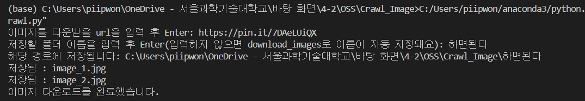

# Crawling_Image Project

>안녕하세요🙂 파이썬을 이용한 **웹 크롤링** 프로젝트 입니다.    
>

## 📌간단한 사용법 

1. 프로그램을 실행해요.
2. 콘솔창에 저장하고 싶은 이미지가 포함된 웹 사이트의 *url*을 입력하고 Enter!
3. 이미지를 저장할 폴더의 이름을 입력하고 Enter!(지정하지 않으면 downloaded_images라는 이름의 폴더에 저장돼요)
4. 콘솔창에 <ul/>"이미지 다운로드를 완료했습니다."</ul> 라는 문구가 뜨면 저장 성공이에요:)

## 📌예시 이미지
*성공적으로 저장되었을 때*

*저장된 모습*

----
*Error!*

